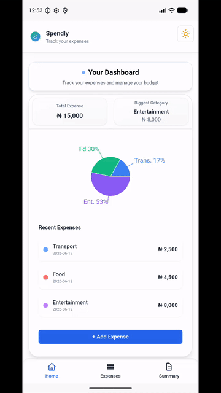
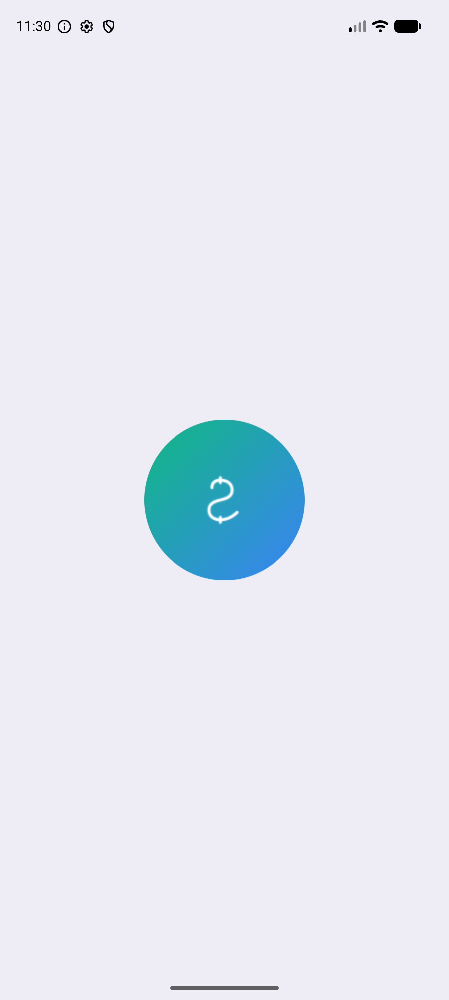
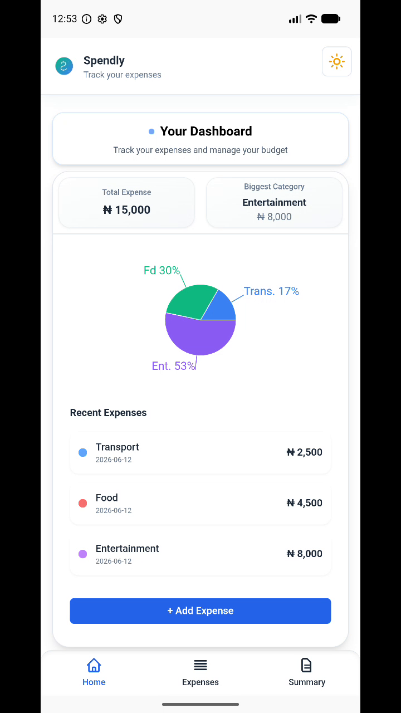
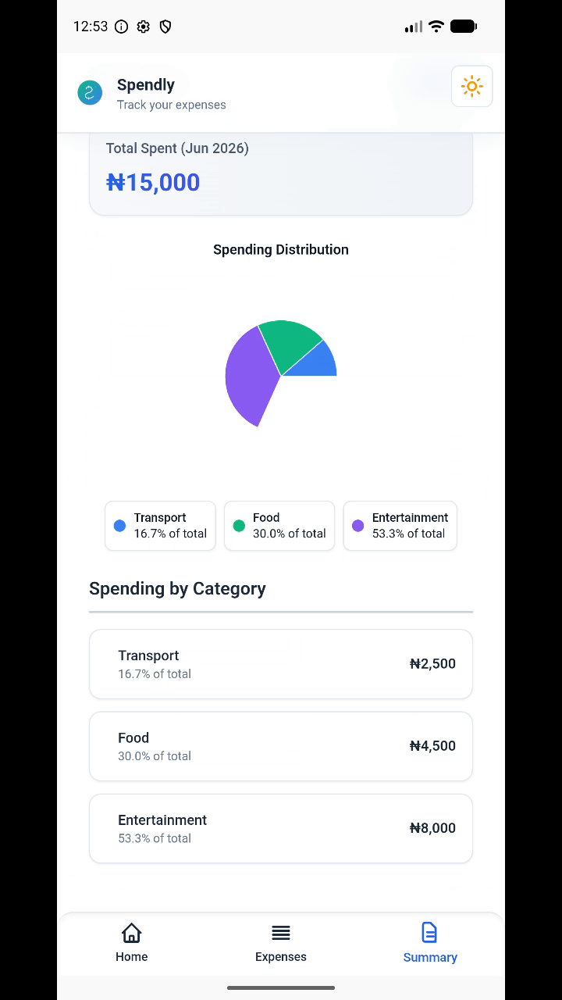

# Spendly – Expense Tracker


[Spendly Live Demo](https://spendlytracks.vercel.app/)  


Spendly is a modern expense tracking web application built with React and Tailwind CSS. It allows users to track expenses by category, manage their budget visually, and view a clear financial summary in a minimalistic interface.

This project emphasizes UI consistency, dark mode toggle, onboarding experience, and smooth navigation using React Router.

**Spendly also ships as a native Android app**, built from the same codebase with Capacitor — see the [Android App](#-android-app-capacitor) section below.

<p align="center">
  
</p>

---

## ✨ Features

- ✅ Onboarding Screen – Introduces the app for first-time users
- ✅ Expense Dashboard – Displays recent expenses and summary
- ✅ Add Expense Form – Intuitive form for adding new transactions
- ✅ Add and delete expenses
- ✅ Local Storage Integration – Data persistence across sessions
- ✅ Custom categories (create, edit, delete)
- ✅ Responsive Design – Works on desktop and mobile seamlessly
- ✅ Filter by category  
- ✅ Search by description  
- ✅ Dark / Light mode 🌗  
- ✅ Date tracking  
- ✅ Monthly summary  
- ✅ Pie chart visualization of spending
- ✅ React Router Navigation – SPA navigation with Outlet for layouts
- ✅ Export expenses as CSV  

  

---

## 📸 Screenshots

>## 📸 Screenshots  

### 🟢 Onboarding  
  


### 🟢 Dashboard


### 🟢 Add Expense  


### 🟢 Summary 


### 🟢 Light mode  


---

## 📱 Android App (Capacitor)

Spendly is packaged as a native Android app using [Capacitor](https://capacitorjs.com/) — one React codebase, deployed to both web and mobile.

**Native features:**

- ✅ Hardware back button – navigates between pages, minimizes from home (like a native app)
- ✅ Adaptive app icon + branded splash screen (light & dark variants)
- ✅ Daily expense reminder at 8 PM via scheduled local notifications
- ✅ Instant warm resume from the recents screen

| Splash | Dashboard | Summary |
|--------|-----------|---------|
|  |  |  |

**📥 Download:** grab `spendly.apk` from the [latest release](https://github.com/Blaqboydee/Spendly/releases/latest) and install it on any Android device.

**Build it yourself:**

```bash
npm install
npm run android:apk      # builds web app, syncs, and assembles the APK
# output: android/app/build/outputs/apk/debug/spendly.apk
```

> Requires JDK 21 and the Android SDK.

---

## 🛠 Tech Stack

- *React* – Frontend framework  
- *LocalStorage* – Data persistence
- *React Router DOM* – Client-side routing
- *Recharts* – Data visualization
- *Capacitor* – Native Android packaging
- *Vercel* – Deployment
- *Tailwind CSS* – Styling   

---

## 🚀 Live Demo

👉 [Spendly Live Demo](https://spendlytracks.vercel.app/)  

---

## ⚡ Installation

1. Clone the repo
   ```bash
   git clone https://github.com/blaqboydee/spendly.git
   cd spendly


   📖 Usage
	1.	Add a new expense with description, amount, and category
	2.	Create your own custom categories (edit or delete later)
	3.	Filter or search expenses
	4.	View monthly summary + pie chart visualization
	5.	Export your expenses to CSV anytime
	6.	Switch between Dark and Light mode 🌗

⸻

🗺 Future Improvements
	•	🔑 User authentication
	•	☁ Cloud sync for data
	•	📊 Budget alerts & goals
	•	📱 iOS version & Play Store release

⸻

🤝 Contributing

Contributions are welcome!
Fork this repo and submit a pull request if you’d like to improve Spendly.

⸻

📄 License

This project is licensed under the MIT License.
